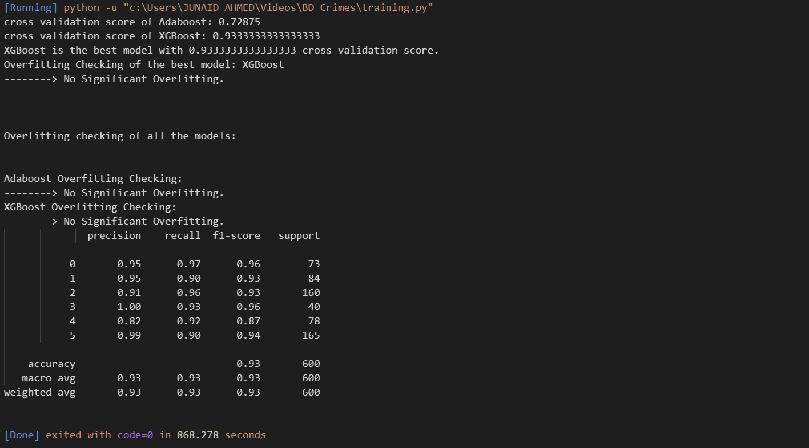

# Crime Classification Project


## **Project Overview**

The **Crime Classification Project** implements a machine learning system to classify crimes into six categories:  
**Murder, Rape, Assault, Body Found, Kidnap, Robbery**.  

The project aims to:  
- Analyze crime data efficiently.  
- Build predictive models to classify crimes accurately.  
- Provide interactive visualization for insights using **Streamlit**.  
- Deploy a user-friendly **Flask web app** for real-time predictions.  

This project uses **XGBoost** and **AdaBoost** classifiers to achieve high accuracy and interpretability.  

---

## **Key Features**

- Data cleaning and preprocessing (`cleaning.py`)  
- Model training, selection, and evaluation (`training.py`)  
- Feature importance analysis  
- Learning curve visualization  
- Streamlit dashboard (`crime_dashboard.py`)  
- Flask web app (`app.py` + `index.html`) for live predictions  
- Model persistence (`model.pkl`, `encoder.pkl`)  

---

## **Folder Structure**

```
crime-classification/
│
├── cleaning.py
├── training.py
├── app.py
├── index.html
├── crime_dashboard.py
├── model.pkl
├── encoder.pkl
├── df.pkl
├── requirements.txt
├── README.md
└── assets/
    ├── dashboard.png
    ├── flask_app.png
    ├── confusion_matrix.png
    ├── feature_importance.png
    └── banner_screenshot.png
```
## **Installation**

### 1. Clone the repository:

```bash
git clone https://github.com/yourusername/crime-classification.git
cd crime-classification
```
### 2. Make the virtual environment

```bash
python -m venv venv
source venv/bin/activate      # Linux/Mac
venv\Scripts\activate         # Windows
```

Install the requirements.

```bash
pip install -r requirements.txt
```

## **Data Description**

The dataset contains numeric and categorical features relevant to crime analysis.
The target column is crime with six classes:

| Crime Type | Label |
|------------|-------|
| Murder     |     0 |
| Rape       |     1 |
| Assault    |     2 |
| Body Found |     3 |
| Kidnap     |     4 |
| Robbery    |     5 |


_Note_: The project currently uses <b>a sample dataset for demonstration</b>, but all scripts are compatible with real crime datasets.

## **Usage**

``` bash
python cleaning.py
python training.py
streamlit run crime_dashboard.py
python app.py
```

## **Flask App Screenshot:**




Dashboard Screenshots


Model Performance

| Model    | Accuracy | Precision | Recall | F1-score |
|----------|----------|-----------|--------|----------|
| XGBoost  | 0.93     | 0.93      | 0.93   | 0.93     |
| AdaBoost | 0.73     | 0.73      | 0.73   | 0.73     |


## Future Work
- Integrate with a real-time crime dataset.
- Improve prediction accuracy with ensemble methods.
- Add geospatial analysis for crime hotspots.
- Deploy the Flask app on cloud platforms (Heroku, AWS).
- Add user authentication for secure usage.


## Contributing
- Fork the repository
- Make your changes
- Submit a pull request

## License
MIT License

## Acknowledgements
- Scikit-learn
- XGBoost
- Streamlit
- Flask
- Plotly


